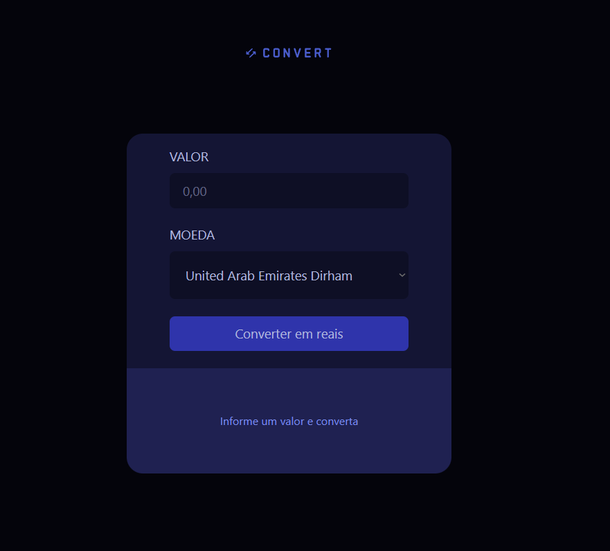

# 💱 Conversor de Moedas

Um simples conversor de moedas desenvolvido com HTML, CSS e JavaScript, utilizando a [API da ExchangeRate](https://www.exchangerate-api.com/) para fornecer taxas de câmbio em tempo real.

## 📸 Preview

Adicione uma imagem chamada `preview.png` na raiz do projeto para visualizar o preview abaixo.

```md

```

## 🚀 Funcionalidades

- Conversão em tempo real entre diversas moedas
- Interface limpa e responsiva
- Atualização automática da taxa de câmbio
- Feedback de carregamento ao buscar dados da API

## 🧪 Demonstração

Você pode testar o projeto acessando: [https://devperess.github.io/conversor-de-moedas/](https://devperess.github.io/conversor-de-moedas/)

## 🛠️ Tecnologias Utilizadas

- HTML5
- CSS3
- JavaScript
- [ExchangeRate API](https://www.exchangerate-api.com/)

## 📦 Como usar localmente

1. Clone este repositório:

```bash
git clone https://github.com/DevPeress/conversor-de-moedas.git
```

2. Acesse a pasta do projeto:

```bash
cd conversor-de-moedas
```

3. Abra o arquivo `index.html` no seu navegador ou utilize uma extensão como **Live Server** no VS Code para facilitar o desenvolvimento.

## 🧠 Aprendizados

Este projeto foi uma oportunidade prática de:

- Trabalhar com requisições `fetch` em JavaScript
- Integrar uma API pública
- Criar interfaces simples e funcionais

## ✨ Contribuições

Sinta-se à vontade para abrir issues ou enviar pull requests com melhorias ou correções. Toda ajuda é bem-vinda!

## 📄 Licença

Este projeto está sob a licença [MIT](LICENSE).

---

### 👨‍💻 Desenvolvido por [Peres](https://www.linkedin.com/in/devperes)

[](https://github.com/xPeres)
[](https://instagram.com/fah.peres)
[](#)
